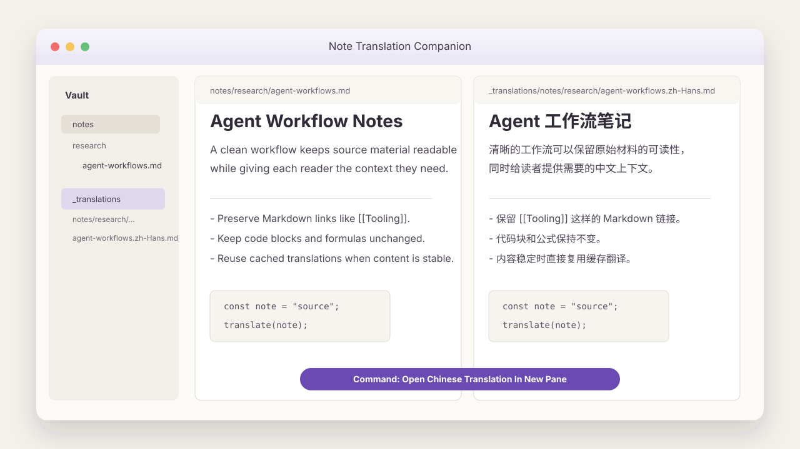

# Note Translation Companion

> 为英文 Obsidian 笔记生成一份简体中文对照笔记，在右侧并排打开，并且不改动原始 Markdown。



[English](README.md) | [简体中文](README.zh-CN.md)

- 在 Obsidian 里用中文 companion pane 阅读英文笔记。
- 保留 frontmatter、代码、公式、链接、标签、wiki link 和属性键。
- 源笔记和 provider 配置没变化时，直接复用缓存翻译。
- 支持 DeepSeek、OpenAI、OpenRouter、通义千问兼容模式，以及其他 OpenAI-compatible provider。

## 快速开始

### 手动安装

1. 从 [Releases](https://github.com/iamdevindeng/obsidian-note-translation-companion/releases) 下载 `main.js`、`manifest.json`、`styles.css`。
2. 在你的 Obsidian vault 中创建目录：

   ```text
   .obsidian/plugins/note-translation-companion/
   ```

3. 将三个文件复制进去。
4. 重启 Obsidian。
5. 进入 **设置 -> 社区插件**，开启 **Note Translation Companion**。

### BRAT 安装

如果你使用 [BRAT](https://github.com/TfTHacker/obsidian42-brat)，可以把这个仓库作为 beta plugin 添加：

```text
https://github.com/iamdevindeng/obsidian-note-translation-companion
```

### 配置 Provider

进入 **设置 -> Note Translation Companion**，配置一个 OpenAI-compatible provider：

| 设置项 | 说明 | 示例 |
| --- | --- | --- |
| API Base URL | 服务商接口地址 | `https://api.deepseek.com/v1` |
| API Key | 你的 API 密钥 | `provider-api-key` |
| Model | 模型标识 | `deepseek-chat` |
| Temperature | 翻译随机性，越低越稳定 | `0.3` |
| Extra Headers (JSON) | 可选 provider 额外 HTTP headers | `{"HTTP-Referer":"https://example.com","X-Title":"Note Translation Companion"}` |
| Extra Body (JSON) | 可选 provider 请求体参数 | `{"thinking":{"type":"disabled"}}` |

`Extra Headers` 只用于 HTTP headers，例如 OpenRouter 的站点归因。`Extra Body` 会合并到 `/chat/completions` JSON body，用于 DeepSeek thinking、`reasoning_effort` 或 provider routing 等模型行为参数。

## 为什么做

Note Translation Companion 面向这样的场景：你在 Obsidian 里阅读英文 Markdown，但希望旁边有一份干净的中文对照，方便理解、标注和回看。

插件把源笔记保留为 source of truth。它会单独生成翻译文件，在右侧打开，并用缓存指纹避免对没变化的笔记反复调用 provider。

维护者说明：这个插件来自我自己的 Obsidian 英文阅读流程。我希望知识工具尽量贴近普通 Markdown vault，而不是把阅读流程绑到复杂系统里。

## 功能一览

| 功能 | 说明 |
| --- | --- |
| 一键翻译 | 在命令面板运行 `Open Chinese Translation In New Pane`。 |
| 自动语言检测 | 中文占比较高的笔记会自动跳过，避免浪费 API 调用。 |
| 智能缓存 | 基于 SHA-256 内容哈希，源笔记未变化时直接打开已有翻译。 |
| 强制刷新 | 运行 `Refresh Translation For Current Note` 可以手动重新翻译。 |
| Markdown 保护 | 保留 frontmatter、代码块、公式、链接、wiki link、标签和属性键。 |
| 自定义 Provider | 支持自定义模型、headers 和 request body 字段。 |
| 60 秒超时 | API 挂起时自动中断，并给出明确错误提示。 |

## 会改动你的 vault 吗？

原始笔记不会被覆盖。插件会根据源笔记的相对路径，在 `_translations/` 下面生成一份 companion translation。

```text
源笔记:   notes/research/agent-workflows.md
翻译文件: _translations/notes/research/agent-workflows.zh-Hans.md
```

翻译文件会在文末写入插件自己的隐藏缓存 metadata。Obsidian 顶部可见的 Properties 区域仍然留给笔记本身使用。

## 使用方式

1. 打开任意英文 Markdown 笔记。
2. 按 `Cmd/Ctrl+P` 打开命令面板。
3. 运行 **Open Chinese Translation In New Pane**。
4. 右侧出现中文 companion note，并排阅读。
5. 后续再次运行命令时，如果源笔记没有变化，会直接打开缓存翻译。
6. 如需强制刷新，运行 **Refresh Translation For Current Note**。

## 常用 Provider 配置

<details>
<summary><b>DeepSeek</b></summary>

- Base URL: `https://api.deepseek.com`
- Model: `deepseek-v4-pro`
- Extra Body (JSON): `{"thinking":{"type":"disabled"}}`

如果需要开启思考模式：

```json
{"thinking":{"type":"enabled"},"reasoning_effort":"high"}
```

DeepSeek 思考模式下，服务商可能会忽略 `temperature`。插件仍然会把 `temperature` 纳入缓存 key，避免请求行为变化后误用旧翻译。

</details>

<details>
<summary><b>OpenAI</b></summary>

- Base URL: `https://api.openai.com/v1`
- Model: `gpt-4o-mini`

</details>

<details>
<summary><b>通义千问 / DashScope 兼容模式</b></summary>

- Base URL: `https://dashscope.aliyuncs.com/compatible-mode/v1`
- Model: `qwen-plus`

</details>

<details>
<summary><b>OpenRouter</b></summary>

- Base URL: `https://openrouter.ai/api/v1`
- Model: `deepseek/deepseek-chat`
- Extra Headers (JSON): `{"HTTP-Referer":"https://your-site.example","X-Title":"Note Translation Companion"}`
- Extra Body (JSON): `{"provider":{"allow_fallbacks":true}}`

</details>

## 工作原理

```text
当前笔记
    |
    v
语言检测
    |
    +-- 中文占比较高 -> 跳过
    |
    v
缓存指纹
    |
    +-- 未变化 -> 打开缓存翻译
    |
    v
OpenAI-compatible API 请求
    |
    v
_translations/<原路径>.zh-Hans.md
    |
    v
右侧 Obsidian pane
```

以下任一输入变化都会触发重新翻译：

- 源文件内容
- 源文件路径
- Provider Base URL
- 模型名称
- Temperature
- Extra Body 请求体参数
- Prompt 版本
- 目标语言

## 已知限制

- 当前版本只专注英文到简体中文的 companion note。
- 当前还没有上架 Obsidian 社区插件目录。
- 翻译质量取决于你配置的 provider 和模型。
- 大笔记可能更慢，也可能产生更高 API 成本。
- API 请求只会从你的本地 Obsidian 发往你配置的 provider；本项目不运行翻译服务器。

## 常见问题

<details>
<summary>翻译速度很慢？</summary>

翻译速度主要取决于你选择的 API provider。本地处理，例如读取文件、检测语言、计算哈希，开销很小。

可以尝试更快的 provider、更小的模型，或在网络更稳定时使用。

</details>

<details>
<summary>缓存什么时候失效？</summary>

源笔记内容、源路径、provider、模型、temperature、extra body、prompt 版本或目标语言任一变化，都会让缓存失效。

</details>

<details>
<summary>中文笔记被跳过了？</summary>

这是预期行为。如果插件检测到中文占比较高，会显示 notice 并跳过翻译。

如果判断不符合预期，通常是因为笔记里包含大量代码块、英文术语或中英文混合内容。可以调整 provider 配置后手动刷新。

</details>

<details>
<summary>API Key 安全吗？</summary>

API Key 存储在 Obsidian 本地插件数据文件 `data.json` 中。本项目没有自己的服务器，也不会上传你的 API Key。插件只会从你的本地 Obsidian 向你配置的 provider 发起请求。

</details>

## 本地开发

```bash
npm install
npm run dev
npm test
npm run build
```

相关文档：

- [PRD summary](docs/prd-summary.md)
- [Backlog](docs/backlog.md)
- [Development rhythm](docs/development-rhythm.md)
- [Changelog](CHANGELOG.md)
- [Agent instructions](AGENTS.md)

实现上保持轻量：TypeScript、Obsidian Plugin API、原生 `fetch()`，不引入 OpenAI SDK。

## Roadmap

- 提交到 Obsidian 社区插件目录。
- 增加从翻译文件打开源笔记、管理翻译缓存等可选命令。
- 首次公开发布后，补齐更轻量的 release 和 smoke test 文档。
- 英译中流程稳定后，再探索多语言 companion note。

## 反馈

- 有 bug？开 [Issue](https://github.com/iamdevindeng/obsidian-note-translation-companion/issues)。
- 有想法？开 [Discussion](https://github.com/iamdevindeng/obsidian-note-translation-companion/discussions)。

目前这个项目只通过 GitHub Issues 和 Discussions 收集反馈。

## 维护者

由 [Devin Deng](https://github.com/iamdevindeng) 构建和维护。我在长期使用 Obsidian 做阅读和知识整理，这个插件是我维护的一组 Markdown-first 小工具之一。

- GitHub: [@iamdevindeng](https://github.com/iamdevindeng)
- X: [@iamdevindeng](https://x.com/iamdevindeng)

## License

[MIT](LICENSE)
